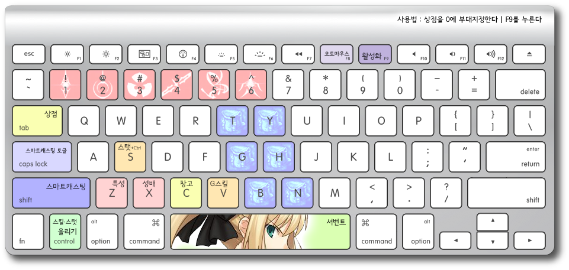
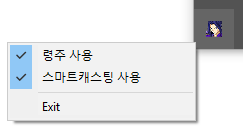

FateOne ![version]
========
> 2012.8.1 ~ 9.1 &nbsp; &nbsp;
> 2013.1.28 ~ 2.3 &nbsp; &nbsp;
> 2016.9.3 ~ *now*

워크래프트 3 유즈맵 [Fate/Another]를 편하게 플레이할 수 있게 해주는 보조
프로그램입니다. 카오스원 없이 [Fate/Another]를 더 편하게 즐기세요. 원클릭 령주,
스마트캐스팅, 빠른 상점접근 등의 기능을 직접 써보세요!

### [다운로드 *Download*][download]

### 사용법
1.  워크래프트와 FateOne을 각각 켭니다.
1.  Fate/Another 게임을 시작합니다.
1.  게임이 완전히 시작되면, <kbd>Ctrl</kbd> + <kbd>0</kbd> 키를 사용하여 상점을
    숫자 <kbd>0</kbd>에 부대지정합니다.
1.  <kbd>F9</kbd>를 누르면 FateOne이 활성화됩니다.

<kbd>F9</kbd>를 다시한번 누르면 언제든지 FateOne을 비활성화시키거나, 다시
활성화시킬 수 있습니다.

**주의**: FateOne을 활성화하면, <kbd>G</kbd>키는 아이템 사용 키로 변합니다.
G스킬을 쓰려면 <kbd>V</kbd>키를 쓰셔야합니다.

 

기능
--------
단축키는 [리그 오브 레전드]나 [히어로즈 오브 더 스톰]에 익숙하신분들이 바로 쓸 수 있도록 골랐습니다.

-   **령주** ―
    <kbd>1</kbd><kbd>2</kbd><kbd>3</kbd><kbd>4</kbd><kbd>5</kbd><kbd>6</kbd>

    *숫자키 하나만 누르면 그 즉시 령주가 나갑니다!*

    죽기 직전 <kbd>3</kbd>만 한번 누르면 그 복잡한 커맨드 전체가 노딜레이로 즉시
    입력됩니다. <kbd>1</kbd><kbd>2</kbd><kbd>4</kbd>, <kbd>2</kbd><kbd>4</kbd>,
    <kbd>2</kbd><kbd>4</kbd>만 연타하면 아주 쉽게 1령 쇼를 벌일 수 있습니다. 참
    쉽죠?

-   **아이템** ―
    <kbd>T</kbd><kbd>Y</kbd><kbd>G</kbd><kbd>H</kbd><kbd>B</kbd><kbd>N</kbd>

    이제 아이템 사용 버튼이 스킬창과 가까운곳에 위치하게됩니다.

-   **스마트캐스팅** ―
    <kbd>Shift</kbd> + <kbd>Q</kbd><kbd>W</kbd><kbd>E</kbd><kbd>R</kbd><kbd>V</kbd>
    <kbd>T</kbd><kbd>Y</kbd><kbd>G</kbd><kbd>H</kbd><kbd>B</kbd><kbd>N</kbd>
     
    **스마트캐스팅 토글** ― <kbd>Caps Lock</kbd>

    *[리그 오브 레전드]의 스마트캐스팅을 [Fate/Another]에서도 쓸 수 있게됩니다!*

    스킬이나 아이템을 쓸때 단축키와 <kbd>Shift</kbd>를 함께 누르면 마우스
    클릭과정을 생략하고 스킬/아이템이 즉시 시전됩니다. 스마트캐스팅 토글을
    쓰면, <kbd>Shift</kbd> 없이 단축키만 눌러도 그 즉시 스킬이 스마트캐스팅으로
    시전됩니다. 그 대신 <kbd>Shift</kbd> + <kbd>Q</kbd>...<kbd>R</kbd> 키가
    일반 스킬시전으로 변합니다. 토글을 풀고싶으시면 <kbd>Caps Lock</kbd>키를
    한번 더 누르시면 됩니다.

-   **상점, 특성, 성배, 창고** 빠르게 접근하기 ―
    Hold <kbd>Tab</kbd>, <kbd>Z</kbd>, <kbd>X</kbd>, <kbd>C</kbd>

    키를 누르고있는동안 상점, 특성창, 성배, 창고를 볼 수 있습니다. 키를 떼면
    자동으로 서번트로 돌아옵니다. <kbd>Tab</kbd>키를 누르면서
    <kbd>Q</kbd><kbd>W</kbd>...<kbd>V</kbd>키를 동시에 누르는 식으로 즉시
    아이템을 구입하고 바로 서번트로 돌아올 수 있습니다. 이제 혼란스러운
    전투상황중에도 바로 특성을 찍으세요!

-   **스킬 레벨업** ― <kbd>Ctrl</kbd> + <kbd>Q</kbd><kbd>W</kbd><kbd>E</kbd><kbd>R</kbd><kbd>V</kbd>
     
    **스텟 찍기** ― <kbd>Ctrl</kbd> + <kbd>S</kbd>

    전투중에도 스탯과 스킬레벨을 즉시 올릴 수 있습니다. [리그 오브 레전드]의
    스킬레벨업과 정확히 같습니다.

-   **서번트 찾기** ― <kbd>Space</kbd>

    한타중 실수로 자신의 서번트를 놓쳐도 <kbd>Space</kbd>키를 한번 누르면
    자동으로 자신의 서번트가 선택됩니다. <kbd>Space</kbd>키를 누르고 길게
    유지하면 카메라의 중심이 서번트로 고정됩니다.

-   **마우스 가두기**

    워크래프트를 창모드로 실행했을경우, 마우스가 워크래프트 화면 밖으로 나오지
    못합니다.

-   오토마우스 ― Hold <kbd>F8</kbd>

    FateOne은 자체 오토마우스를 내장하고있습니다. <kbd>F8</kbd>가가 눌려있는동안
    마우스 왼쪽버튼이 매우 빠른속도로 자동으로 클릭됩니다.

-   자동 비활성화

    채팅중이거나, <kbd>Alt</kbd> + <kbd>Tab</kbd>로 워크래프트 밖으로 나갈경우
    자동으로 프로그램이 비활성화됩니다.

-   트레이아이콘

    

    평소에 부대지정기능을 쓰시나요? 스마트캐스팅이 필요없으신가요?
    트레이아이콘을 우클릭하시면 령주기능과 스마트캐스팅 기능을 끌 수 있습니다.
    숫자키를 원래 쓰시던대로 사용하세요.

 

 

왜 만들었나요?
--------
FateOne은 제가 고등학교 2학년때 친구들과 같이 직접 쓰려고 만든 프로그램입니다.
[Fate/Another]는 분명 재미있는 게임이지만 미친듯이 어려운 게임이기도 합니다.
고2때 12명 모아서 친구들이랑 게임을 하고싶었는데 다들 령주쓰는걸 너무 어려워해서
만들게되었습니다.

#### 핵인가요?
아닙니다.

#### 이 기능도 넣어주세요
[이슈트래커]에 원하시는 기능을 쓰시거나, <simnalamburt@gmail.com>로 메일을
보내주세요.

 

--------

[GPLv3 License](LICENSE)

[version]: https://img.shields.io/badge/version-1.4.4-blue.svg
[download]: https://github.com/simnalamburt/FateOne/releases/download/v1.4.4/FateOne.exe
[.net]: https://download.microsoft.com/download/7/B/6/7B629E05-399A-4A92-B5BC-484C74B5124B/dotNetFx40_Client_setup.exe

[Fate/Another]: http://cafe.naver.com/ufw.cafe?iframe_url=/ArticleList.nhn%3Fsearch.menuid=22
[리그 오브 레전드]: https://kr.leagueoflegends.com/
[히어로즈 오브 더 스톰]: http://kr.battle.net/heroes/ko/
[이슈트래커]: https://github.com/simnalamburt/FateOne/issues
